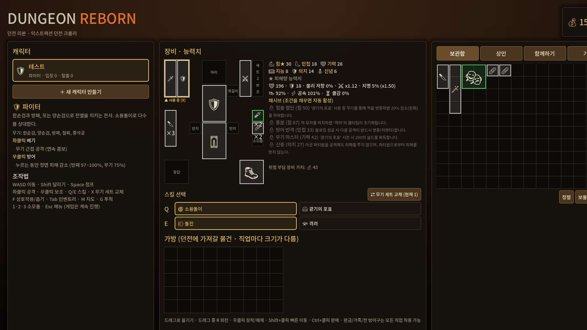
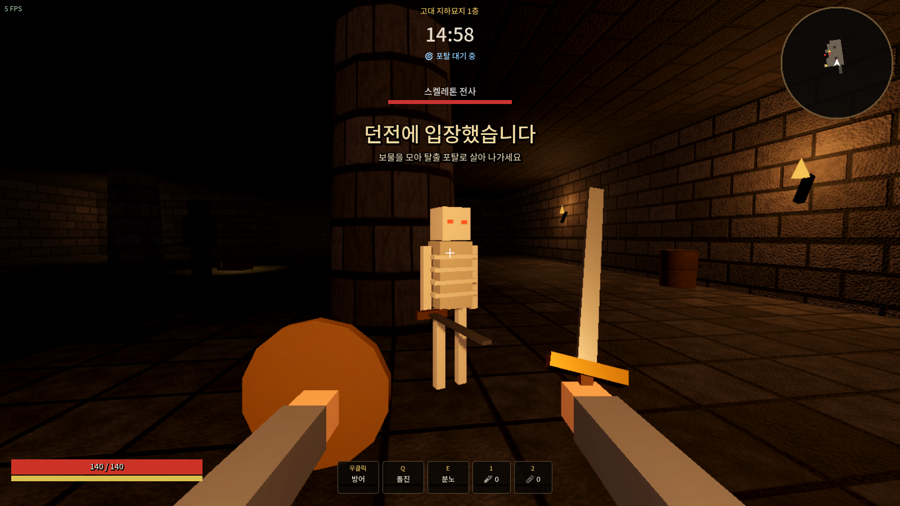
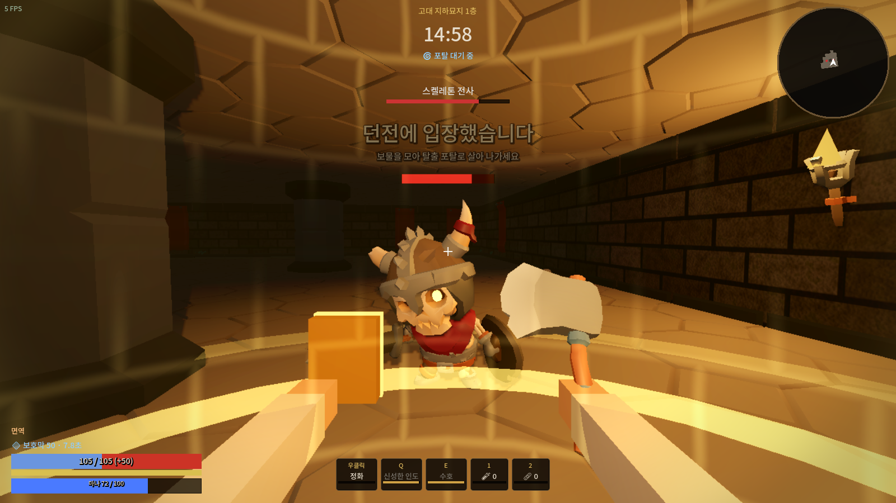
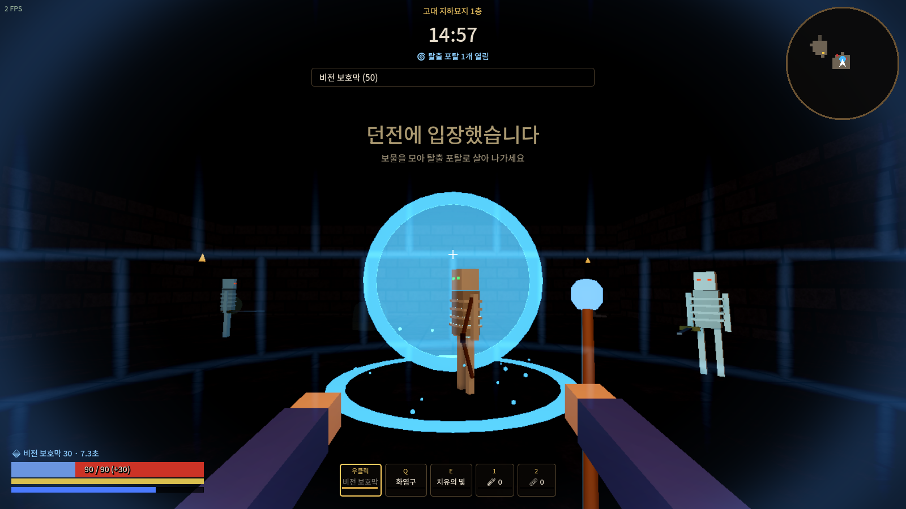
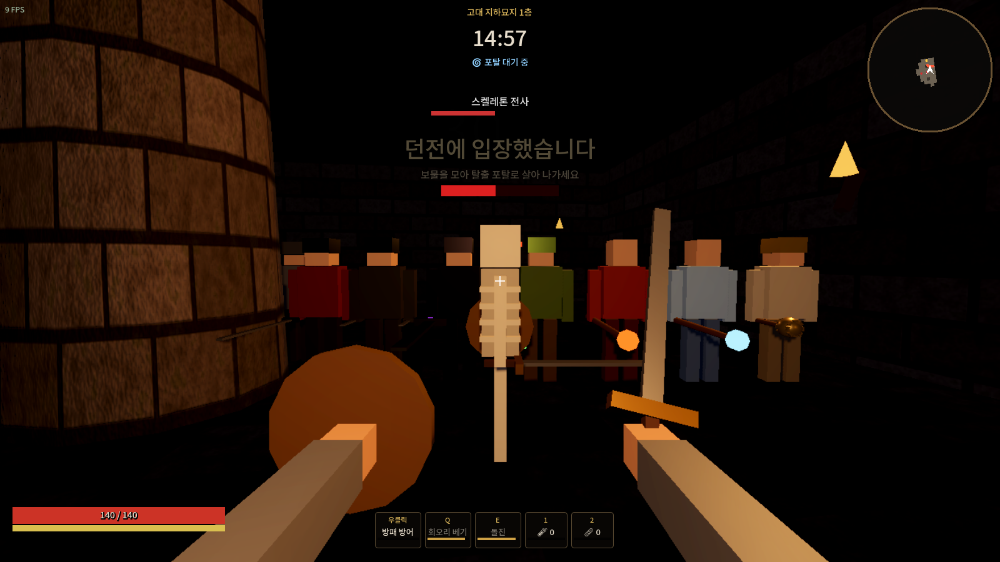
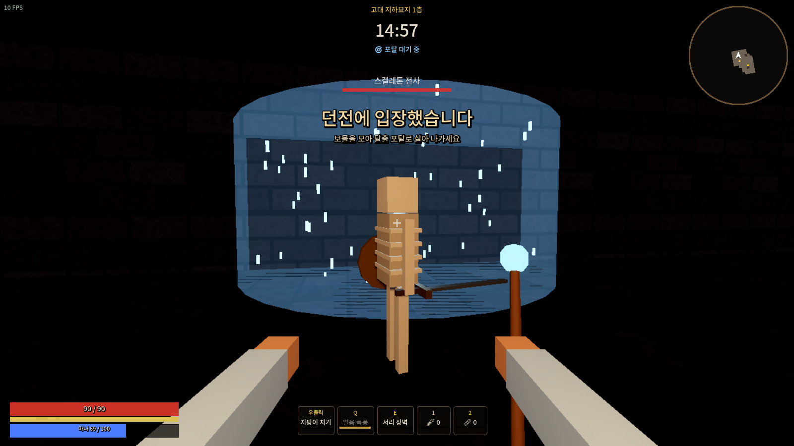
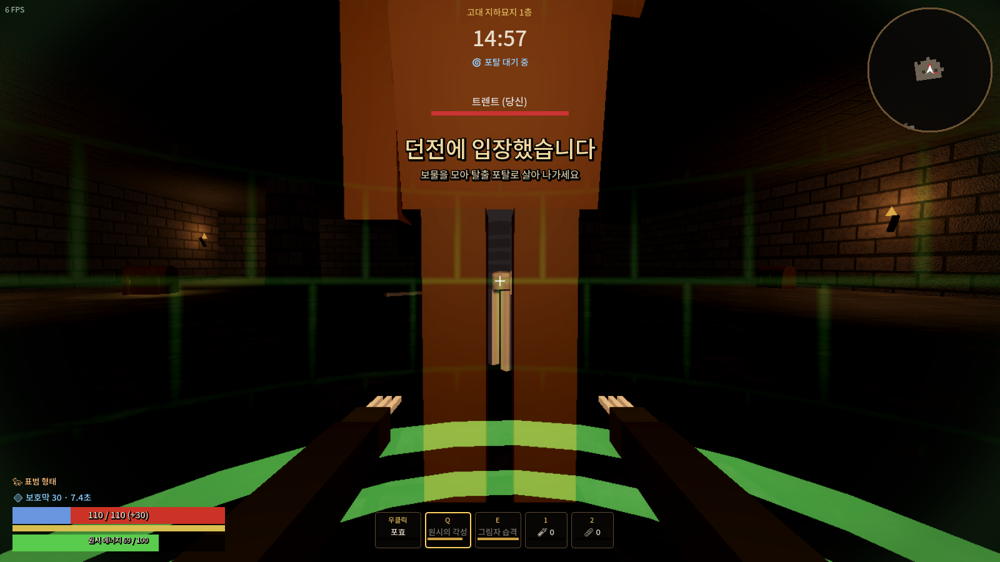

# Dungeon Reborn

**Dungeon Reborn**은 서비스가 종료된 중세 판타지 익스트랙션 던전 크롤러 *Dungeonborne*에서 영감을 받아 만든 1인칭 3D 게임입니다.
던전에 들어가 몬스터와 다른 모험가를 상대하며 보물을 모으고, 탈출 포탈로 살아 나가야 전리품을 지킬 수 있습니다.

> 팬 메이드 오마주 프로젝트입니다. 원작의 에셋, 코드, 상표는 사용하지 않았고 모든 그래픽과 사운드는 코드로 생성합니다.

| 로비 | 전투 (전사) |
|---|---|
|  |  |
| **마법사 비전 보호막** | **탈출 포탈** |
|  |  |

> 스크린샷은 그래픽카드가 없는 환경에서 소프트웨어 렌더링(호환 모드)으로 찍은 것이라 실제 PC 화면보다 단순하게 보입니다.

## 실행 방법 (Godot 4.5)

1. [Godot 4.5 (Standard)](https://godotengine.org/download/windows/)를 내려받습니다. 설치 없이 압축만 풀면 되는 실행 파일 하나입니다. (.NET 버전 아님)
2. Godot를 실행하고 **가져오기(Import)** → 이 저장소의 `godot/project.godot` 파일을 선택합니다.
3. 프로젝트가 열리면 오른쪽 위 **▶ (F5)** 를 누르면 게임이 실행됩니다.

처음 열 때 폰트와 텍스처를 가져오느라 몇 초 걸릴 수 있습니다.

### 실행 파일(.exe)로 만들기

1. 에디터 메뉴 **편집기 → 내보내기 템플릿 관리**에서 템플릿을 내려받습니다 (최초 1회).
2. **프로젝트 → 내보내기** → `Windows Desktop` 프리셋 → **프로젝트 내보내기**.
3. `godot/export/DungeonReborn.exe` 하나만 있으면 어디서든 실행됩니다.

## 게임 흐름

1. **로비**: 직업 선택, 보관함 장비 장착, 상인에게 물약과 장비 구매, 가방에 가져갈 물건 넣기
2. **던전 입장**: 장착한 장비와 가방 속 물건은 이 시점부터 위험에 노출됩니다
3. **탐험**: 상자를 열고 몬스터와 경쟁 모험가(AI)를 쓰러뜨려 전리품 획득
4. **포탈**
   - 🔵 **탈출 포탈**: 2분 후부터 열립니다. 포탈 위에 3초간 서 있으면 탈출
   - 🔴 **심연 포탈**: 3분 30초쯤 잠시 열립니다. 더 강한 적과 더 값진 보물이 있는 2층으로 이동
5. **붕괴**: 15분이 지나면 던전이 무너져 남은 모든 것이 사라집니다
6. **결과**: 탈출하면 모든 소지품이 보관함으로, 사망하면 모두 잃습니다

던전본처럼 **Esc 메뉴나 인벤토리를 열어도 게임은 멈추지 않습니다.** 열어 둔 채로도 이동할 수 있습니다.

## 직업 (던전본의 8개 직업)

| 직업 | 자원 | 좌클릭 | 우클릭 | Q | E |
|---|---|---|---|---|---|
| 🛡 파이터 | - | 베기 | 방패 방어 | 회오리 베기 | 돌진 (기절) |
| ⚔ 소드마스터 | - | 연속 베기 | 패링 (근접 공격자 기절) | 사이오닉 블레이드 (추적 검 4자루, 적중 시 회복) | 회오리 검 (8초, 받는 피해 -25%) |
| 🗡 로그 | - | 찌르기 (등 뒤 1.6배, 은신 중 2.5배) | 단검 투척 | 석화 독 (속박 + 중독) | 은신 (1.5초 집중 후 15초) |
| 💀 데스나이트 | 영혼 | 내려베기 (흡혈, 영혼 획득) | 방어 | 영혼의 장막 (주변 둔화 + 암흑 피해) | 무덤의 손아귀 (끌어당기기 + 기절) |
| 🌿 드루이드 | 원시 에너지 | 가시 덩굴 / (표범) 할퀴기 | 지팡이 치기 / (표범) 포효 | 원시의 각성 (표범 변신) | 자연의 힘 (트렌트 소환 + 보호막) / (표범) 그림자 습격 |
| 🔥 파이로맨서 | 마나 | 화염탄 (추적) | 지팡이 치기 | 화염 폭발 | 화염 파동 (넓은 범위 밀쳐내기) |
| ❄ 크라이오맨서 | 마나 | 얼음 화살 (둔화) | 지팡이 치기 | 얼음 폭풍 (조준 지점 지속 피해 + 둔화) | 서리 장벽 (3초 무적 + 회복) |
| ✨ 프리스트 | 마나 | 철퇴 | 정화 (눌렀다 놓기, 충전할수록 회복량 증가) | 신성한 인도 (아군 치유·정화, 적 피해) | 수호 (보호막 50) |

AI 모험가도 같은 8개 직업 중 하나로 나오며, 직업에 맞는 스킬을 상황에 따라 사용합니다.
은신한 적은 3m 안으로 다가오기 전에는 감지되지 않습니다.

| 8직업 AI 모험가 | 크라이오맨서 얼음 폭풍 | 드루이드 표범 형태 |
|---|---|---|
|  |  |  |

### 스태미나

달리기(Shift)는 스태미나를 소모합니다. 스태미나가 10 미만이면 Shift를 눌러도 걷기로 처리되고,
완전히 바닥나면 "지침" 상태(스태미나 바가 붉게 표시)가 되어 30까지 회복해야 다시 달릴 수 있습니다.
그래서 Shift를 계속 누르고 있어도 걷기/달리기가 짧게 반복되지 않습니다.

## 조작법

| 키 | 동작 |
|---|---|
| WASD / Shift / Space | 이동 / 달리기 / 점프 |
| 마우스 좌·우클릭, Q, E | 공격과 스킬 |
| F | 상자 열기(길게 누르기), 전리품 살펴보기 |
| Tab | 인벤토리 (장착·사용·버리기) |
| 1 / 2 | 체력 물약 / 붕대 |
| M | 전체 지도 |
| Esc | 메뉴: 감도·그래픽 품질 설정, 레이드 포기 (게임은 계속 진행) |

그래픽 품질(Esc 메뉴): **낮음**은 3D 해상도 67%(FSR)·그림자/글로우 끔, **보통**은 85%(FSR)·그림자/글로우, **높음**은 100%·MSAA 2x·SSAO.

## 프로젝트 구조

```
godot/                     Godot 4.5 프로젝트 (현재 버전)
  project.godot
  scenes/main.tscn
  scripts/
    main.gd                진입점, 입력, 로비↔레이드↔결과, 그래픽 설정, 자동 테스트
    game.gd                레이드 진행: 전투, 투사체, 이펙트, 상자, 포탈, 붕괴
    player.gd              1인칭 조작, 스킬 입력, 스태미나
    skills.gd              8직업 스킬 규칙 (플레이어와 AI가 공용)
    summon.gd              드루이드 트렌트
    view_anim.gd           1인칭 뷰모델 애니메이션
    asset_registry.gd      3D 모델 교체 지점 (assets/ 폴더)
    character_rig.gd       캐릭터 모델 + 애니메이션 인터페이스
    actor.gd / ai_actor.gd 공통 액터와 AI 이동/감지
    monster.gd / bot.gd    몬스터와 경쟁 모험가 AI
    dungeon.gd             던전 생성, MultiMesh 렌더링, 횃불 조명, 충돌/시야/경로
    models.gd / textures.gd 기본 도형 모델, 절차적 텍스처(노멀맵 포함)
    data.gd / save_data.gd / sfx.gd  데이터, 저장(user://save.json), 합성 효과음
    ui/                    로비, HUD, 미니맵, 공용 UI
  shaders/                 체력바, 보호막, 화면 가장자리 효과
  fonts/                   Noto Sans KR, Noto Emoji (SIL OFL)
  assets/                  실제 3D 모델을 넣는 곳 (비어 있으면 블록 모델 사용) - docs/ART_PIPELINE.md
web-prototype/             초기 브라우저(Three.js) 시제품
```

### 자동 테스트

```bash
godot --path godot --headless --fixed-fps 60 -- --autotest
```

8개 직업으로 각각 기본 공격, Q/E 스킬, 탈출을 실행하고, 스태미나 연속 달리기 검사와 150초 레이드 시뮬레이션을 돌려 결과를 출력합니다.

## 그래픽 업그레이드

지금은 블록 모델이지만 `godot/assets/`에 정해진 이름의 `.glb` 파일을 넣으면 코드 수정 없이 실제 3D 모델로 바뀝니다.
캐릭터, 1인칭 손, 무기, 던전 타일, 상자 모두 교체할 수 있습니다. 자세한 규칙: [docs/ART_PIPELINE.md](docs/ART_PIPELINE.md)

## 라이선스 참고

- 폰트: Noto Sans KR, Noto Emoji — SIL Open Font License 1.1 (`godot/fonts/OFL-*.txt`)
- 웹 시제품의 Three.js — MIT
