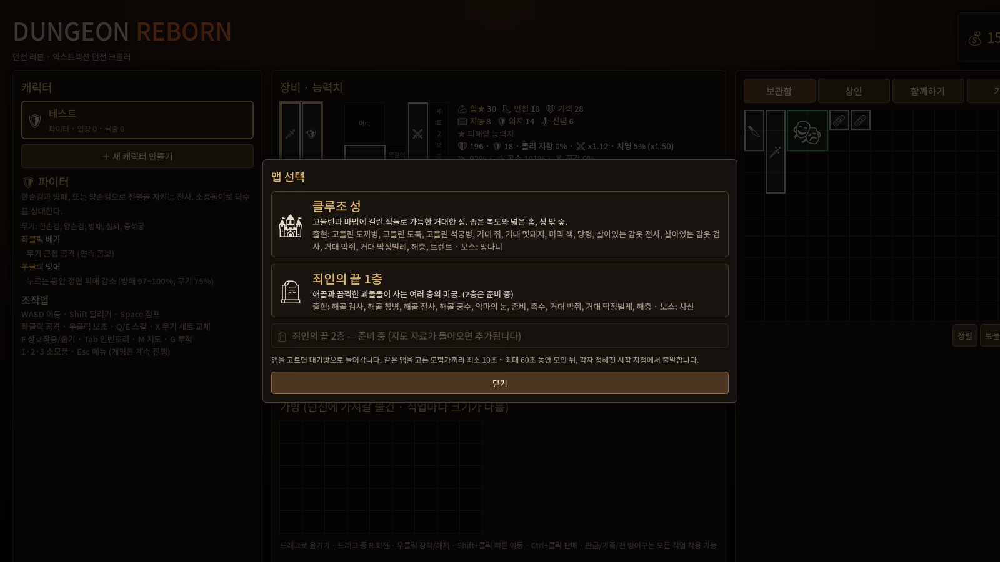
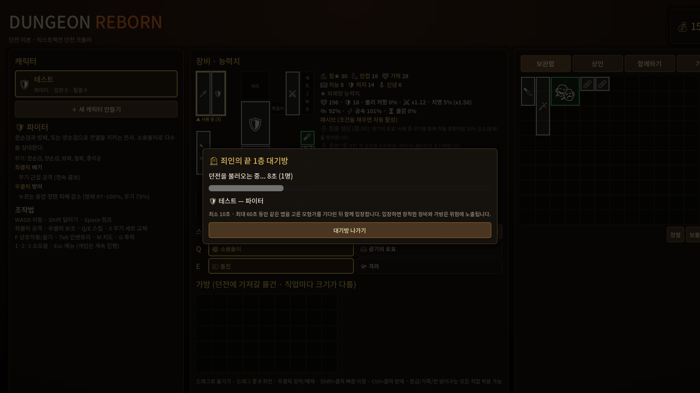
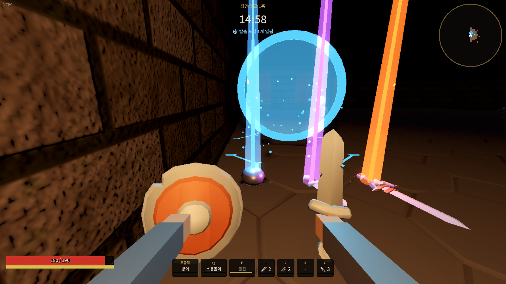
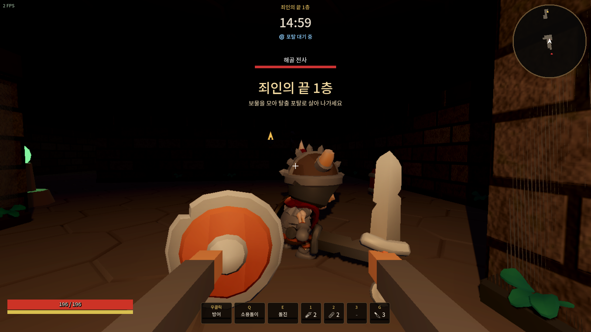
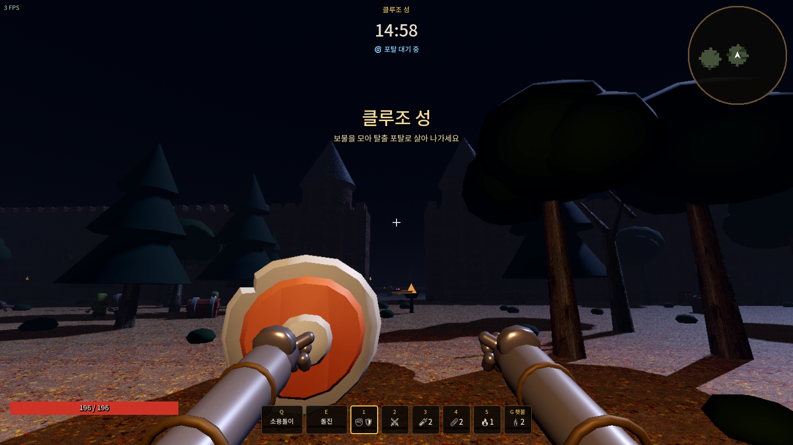
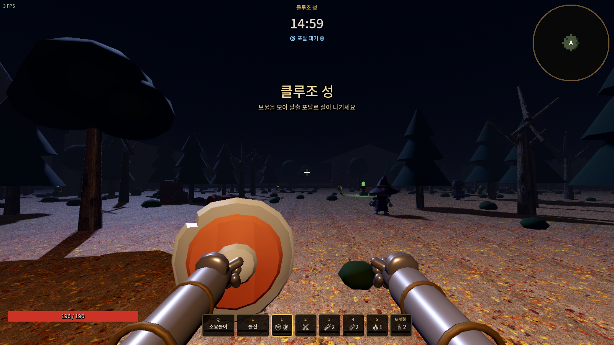
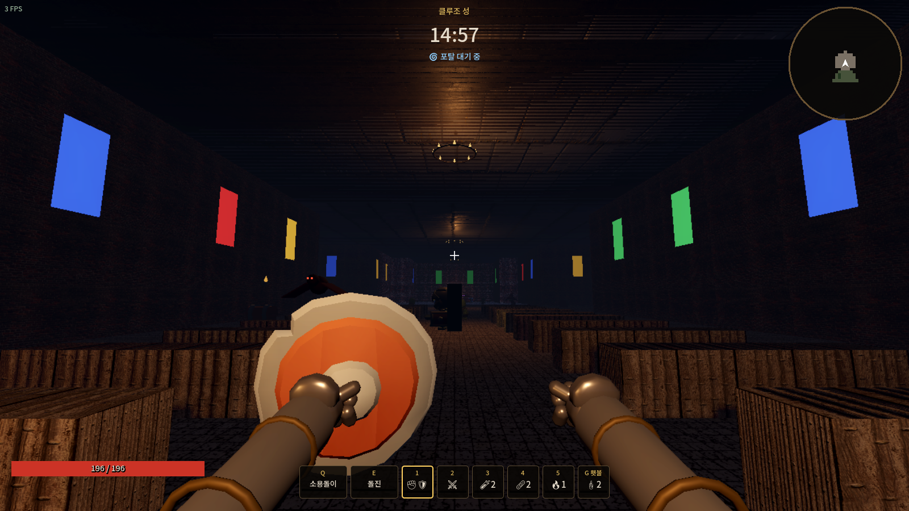
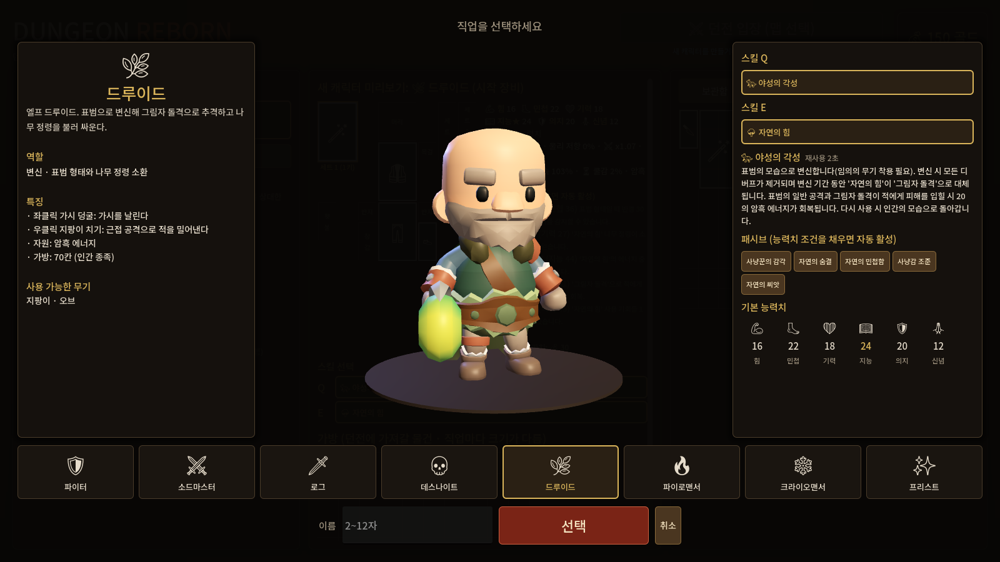
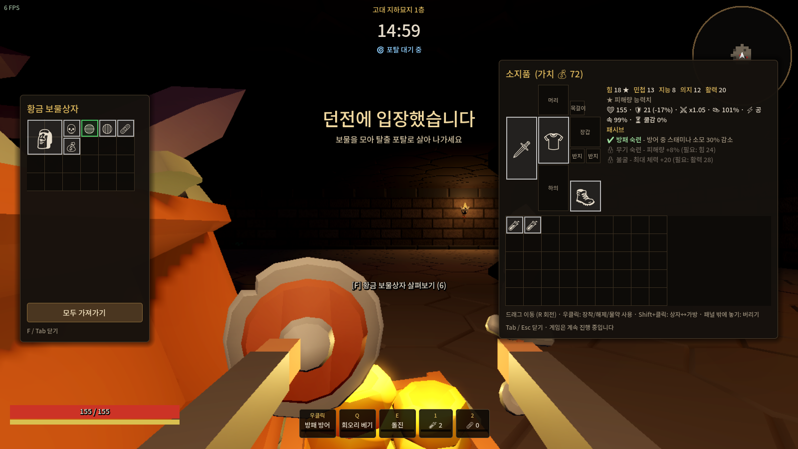

# Dungeon Reborn

**Dungeon Reborn**은 서비스가 종료된 중세 판타지 익스트랙션 던전 크롤러 *Dungeonborne*에서 영감을 받아 만든 1인칭 3D 게임입니다.
던전에 들어가 몬스터와 다른 모험가를 상대하며 보물을 모으고, 탈출 포탈로 살아 나가야 전리품을 지킬 수 있습니다.

> 팬 메이드 오마주 프로젝트입니다. 원작의 에셋, 코드, 상표는 사용하지 않았고 모든 그래픽과 사운드는 코드로 생성합니다.

| 로비 (캐릭터 · 장비 · Q/E 스킬) | 맵 선택 |
|---|---|
|  |  |
| **대기방 (최소 10초 ~ 최대 60초)** | **바닥에 버린 아이템 (등급 빛줄기)** |
|  |  |
| **죄인의 끝 1층** | **클루조 성** |
|  |  |
| **클루조 성 - 숲** | **클루조 성 - 성당** |
|  |  |

> 스크린샷은 그래픽카드가 없는 환경에서 소프트웨어 렌더링(호환 모드)으로 찍은 것이라 실제 PC 화면보다 단순하게 보입니다.

## 실행 방법 (Godot 4.5)

1. [Godot 4.5 (Standard)](https://godotengine.org/download/windows/)를 내려받습니다. 설치 없이 압축만 풀면 되는 실행 파일 하나입니다. (.NET 버전 아님)
2. Godot를 실행하고 **가져오기(Import)** → 이 저장소의 `godot/project.godot` 파일을 선택합니다.
3. 프로젝트가 열리면 오른쪽 위 **▶ (F5)** 를 누르면 게임이 실행됩니다.

처음 열 때 폰트와 텍스처를 가져오느라 몇 초 걸릴 수 있습니다.

### 실행 파일(.exe)로 만들기

1. 에디터 메뉴 **편집기 → 내보내기 템플릿 관리**에서 템플릿을 내려받습니다 (최초 1회).
2. **프로젝트 → 내보내기** → `Windows Desktop` 프리셋 → **프로젝트 내보내기**.
3. `godot/export/DungeonReborn.exe` 하나만 있으면 어디서든 실행됩니다.

## 친구와 함께하기 (온라인)

로비의 **함께하기** 탭에서 한 명이 **호스트 열기**, 친구들은 호스트 주소로 **접속**합니다.
그다음 각자 **⚔ 던전 입장 → 맵 선택**을 하면 **같은 맵을 고른 사람끼리 대기방**에 모입니다.
대기방은 최소 10초(로딩) ~ 최대 60초 동안 사람을 기다리고, 대기실의 모두가 대기방에 들어오면 10초 뒤, 아니면 60초가 지나면 출발합니다.
파티(아군)면 같은 시작 지점, 개인전(서로 적)이면 각자 다른 시작 지점에서 출발합니다. 화면 없는 전용 서버(`-- --server`)도 지원합니다.
주소 고르는 법(같은 와이파이, Tailscale, 포트포워딩 UDP 7777)과 규칙은 **[docs/MULTIPLAYER.md](docs/MULTIPLAYER.md)** 를 보세요.

**☁ 온라인(클라우드) 서버**: AWS Lightsail/EC2에 Docker로 서버를 띄우면 이름+PIN 계정으로 접속하고 보관함·골드·캐릭터가 서버에 저장됩니다 → **[docs/ONLINE_SERVER.md](docs/ONLINE_SERVER.md)**

> 현재 서버 하나에서 레이드는 한 번에 하나만 진행됩니다. 다른 맵 대기방은 앞선 레이드가 끝나면 출발합니다.

## 맵 (던전본 지도 기반)

| 맵 | 지도 | 몬스터 | 보스 |
|---|---|---|---|
| 🏰 **클루조 성** | 12m 성벽·탑으로 둘러싼 큰 성(자갈 안뜰, 16m 본성과 기둥 늘어선 큰 홀, 막사·창고) · 서쪽 밤의 숲(길·빈터·폐허) · 남서쪽 십자형 성당(높은 천장, 스테인드글라스, 긴 의자, 제단, 종탑). 밤하늘과 달빛, 화로·샹들리에 (`tools/gen_castle_map.py`로 생성) | 고블린 도끼병·도둑·석궁병, 거대 쥐·멧돼지·박쥐·딱정벌레, 미믹 책, 망령, 살아있는 갑옷 전사·검사, 트렌트, 해충 | 망나니 |
| 🪦 **죄인의 끝 1층** | 1층 지도 이미지 그대로 (64x64칸, 칸당 4m) | 해골 검사·창병·전사·궁수, 악마의 눈, 좀비, 촉수, 거대 박쥐·딱정벌레, 해충 | 사신 |
| 🪦 죄인의 끝 2층 | 준비 중 (지도 자료를 받으면 추가) | | |

- **시작 지점**: 지도에 표시된 스폰 위치(죄인의 끝 10곳)에서 무작위로 배정. 남은 스폰 위치에는 경쟁 모험가(AI) 팀이 나옵니다. 시작 지점 주변 방에는 몬스터가 없습니다.
- **성소** (죄인의 끝 29곳): F를 길게 눌러 체력 50% 회복 + 중독/화상 해제 (한 번만).
- **부활석** (각 5곳): 쓰러진 파티원이 부활 대기(20초) 중일 때 F를 길게 눌러 부활석 옆에 되살립니다.
- **탈출구**: 지도에 정해진 탈출 지점이 있으면 그곳에 탈출 포탈이 먼저 열립니다. **아래층 계단**은 2층 준비 중이라 막혀 있습니다.
- **정예 몬스터**(카즈라)와 **미믹**(상자로 위장)이 일부 방에 나옵니다.

몬스터 AI 종류: 근접 · 방패(막기, 3번 막으면 방패가 무너져 기절) · 원거리 · 마법진(악마의 눈: 발밑에 마법진 → 폭발) · 돌진(예고 후 일직선 돌진) · 도망(체력이 낮으면 도망) · 침 뱉기(멈춰서 독침) · 잠복(좀비/촉수: 땅속에서 나타남) · 미믹 · 무해(해충).

## 캐릭터 (던전본처럼 직업별 캐릭터)

- 로비 왼쪽 **캐릭터** 패널에서 **＋ 새 캐릭터 만들기** → **직업 선택 화면**(던전본처럼: 왼쪽 직업 설명·역할·특징·사용 무기, 가운데 캐릭터 모습, 오른쪽 스킬·패시브·기본 능력치, 아래 8직업) → 이름(2~12자) → **선택**. 최대 8명.

  
- 캐릭터마다 **직업 · 장비 · 가방 · Q/E 스킬 · 무기 세트**가 따로 있고, **골드 · 보관함 · 기록은 공용**입니다.
- 새 캐릭터는 직업 기본 무기, 낡은 방어구(상의·하의·신발), 소모품 칸 3에 치료 물약 2, 4에 붕대 2, 5에 화염 플라스크 1로 시작합니다. 횃불은 던전 입장 때 2개를 받습니다.
  파이터는 세트 2에 양손검(소용돌이용), 프리스트는 세트 2에 지팡이(신의 계시·치료용)를 가지고 시작합니다 (2키로 꺼냄).
- **Q/E 스킬 선택**: 장비창 아래 **스킬 선택**에서 직업의 Q/E 후보 중 하나씩 고르고 입장합니다 (마우스를 올리면 설명).

| 직업 | 자원 | Q 후보 | E 후보 |
|---|---|---|---|
| 🛡 파이터 | - | 소용돌이(양손 무기) / 광기의 포효 | 돌진 / 격려 |
| ⚔ 소드마스터 | - | 심령의 검 | 검날의 춤 |
| 🗡 로그 | - | 석화 중독 / 칼날 뿌리기 | 은신 / 신속한 은폐 / 어둠의 장막 |
| 💀 데스나이트 | 영혼 에너지 | 악령의 보호 / 영혼폭풍 | 영혼의 족쇄 |
| 🌿 드루이드 | 암흑 에너지 | 야성의 각성 (표범) | 자연의 힘 (나무 정령) |
| 🔥 파이로맨서 | 마나 | 화염 폭발 (누르고 충전) | 화염 충격 |
| ❄ 크라이오맨서 | 영혼 에너지 | 눈보라 / 서리의 저주 | 아이스 아머 / 얼음 베리어 |
| ✨ 프리스트 | 마나 | 신의 계시 / 치료 (지팡이·오브) | 성스러운 가호 / 수호 |

- **능력치 6개**: 힘 · 민첩 · 기력 · 지능 · 의지 · 신념. ★ 표시가 그 직업의 피해량 능력치입니다.
- **패시브 5개**: 직업마다 5개, 능력치 조건(예: 힘 50)을 채우면 자동 활성. 로비/인벤토리 능력치 패널에서 🔒/✔ 확인.

## 아이템과 인벤토리 (던전본 방식)



- **파밍 화면 (던전본)**: 왼쪽 = 대상(상자 또는 시체), 가운데 = 내 정보(캐릭터 모습·능력치 6개·Q/E·패시브), 오른쪽 = 내 장비창 + 가방.
  쓰러진 모험가의 시체를 열면 **상대의 장비 칸과 가방이 내 장비창과 똑같은 모양**으로 보이고, 드래그/우클릭으로 가져옵니다.
- **장비창 배치**: 왼쪽 위 **세트 1(주무기/보조)**, 가운데 위 **머리**, 오른쪽 위 **세트 2** · 가운데 **상의**와 오른쪽 **목걸이** ·
  왼쪽 **횃불 칸(G)** · **반지 – 하의 – 반지** · 하의 왼쪽 아래 **장갑(2x2)**, 오른쪽 아래 **신발(2x2)** · 오른쪽 **소모품 칸 3·4·5** · 소드마스터는 아래에 **검 슬롯 4칸**.
- **양손 무기**(양손검·지팡이·석궁)는 가로 2칸 크기이고, 장착하면 그 세트의 **주무기·보조 두 칸을 모두 차지**합니다.
- **소모품**: 등급이 없어서 같은 종류는 모두 합쳐지고, 한 칸에 **최대 3개**까지 겹칩니다.
  붕대, 마시기(체력 물약·미믹·방어 플라스크), 던지기(화염·대지·전기 플라스크). 플라스크는 가방에서 사용되지 않습니다.
- **우클릭 = 장착 (내 가방에서)**: 소모품은 ① 같은 종류가 있는 칸에 겹치고 ② 아니면 빈 칸에 ③ 칸이 다 차 있으면 3번 칸과 교체됩니다.
- **창고·상대 가방·상자·시체 장비에서 우클릭**: 내 장비는 절대 바뀌지 않습니다. 소모품은 같은 종류 칸에 **나눠 겹치고**(예: 3번 칸 물약 2개 + 상대 물약 3개 → 1개는 3번 칸, 2개는 내 가방), 장비·소모품 모두 ① 빈 장착 칸 ② 내 가방 순으로 들어옵니다. 가방이 꽉 차면 남은 것은 그 자리에 두고 "가방이 가득 찼습니다" 알림이 뜹니다. **끌어다 놓기는 의도적인 행동이라 상대 가방에서도 항상 장착**됩니다. 밀려난 기존 장비는 내 가방으로 가고, 가방이 꽉 차 있으면 상대 가방(끌어온 자리)으로 맞교환됩니다.
- **횃불**: 던전에 들어갈 때 기본 2개 지급(최대 3개 겹침). G로 불을 붙이면 2분 동안 주변이 넓고 밝게 보입니다.
- **가방 크기 (가로 10칸)**: 인간 종족(파이터·로그·프리스트·파이로맨서·소드마스터·드루이드) 7줄, 언데드 종족(데스나이트·크라이오맨서) 6줄. 보관함 12x10.
- **격자 인벤토리**: 상의·하의 2x3, 투구·장갑·신발 2x2, 한손검 1x3, 단검 1x2, 양손검·지팡이 2x4, 석궁·방패 2x3 … 드래그 중 **R**로 회전.
- **조작**: 드래그로 이동/장착 · **우클릭** 장착·해제 · **Ctrl+클릭** 판매(로비) ·
  **Shift+클릭**: 로비에서는 보관함↔가방, **던전에서는 내 인벤토리(가방·장비)의 아이템을 항상 바닥에 버리기**.
- **바닥 아이템**: 유저가 버린 아이템은 **아이템 모양 그대로 바닥에 놓이고 등급 색의 빛줄기**(일반 흰색 → 고급 초록 → 희귀 파랑 → 영웅 보라 → 전설 주황)가 올라옵니다. **F**로 줍습니다.
- **아이템 데이터**: 던전본 위키 자료(방어구 판금/가죽/천 × 부위 × 등급, 한손검·양손검·방패·중석궁·지팡이·오브·단검·철퇴, 전설 고유 효과, 세트 효과).
  고정 옵션은 범위 안에서 굴리고, 등급에 따라 무작위 옵션(Δ/Φ/Ω 단계)과 세트 포인트가 붙습니다.

## 전투 감각

- **예비 동작**: 모든 무기 공격은 휘두르기 시작 → 칼날이 닿는 순간에 피해가 들어갑니다 (양손검은 묵직하게, 단검은 빠르게). 휘두르는 범위 안에 실제로 있는 대상만 맞습니다.
- **피격 표시**: 맞히면 조준선에 **X**가 잠깐 뜨고, 피해 숫자가 떠오릅니다. **치명타·기습은 주황색 큰 숫자와 느낌표(!)**, 처치는 빨간 X.
- **석화**: 석화된 대상을 때리면 석화가 풀리고 그 공격은 **0**으로 표시됩니다.
- **무기 꺼내기**: 1/2키로 세트를 바꾸거나 소모품을 들면 잠깐 꺼내는 동작이 있고 그동안 공격할 수 없습니다. 검·단검은 칼 뽑는 소리, 석궁·지팡이는 무거운 목재 소리.
- **우클릭 = 무조건 방어 자세**: 어떤 무기를 들어도 우클릭은 방어입니다 (방패 97%, 무기 75%, 단검은 양손을 교차해 50%).
- **석궁 볼트**: 볼트(1x2, 최대 30개 겹침, 상인에서 30개 묶음 판매)는 따로 장착 칸 없이 **가방에 들고 다니면** 석궁이 가방 볼트로 장전합니다.
  쏘면 화면 오른쪽 아래 표시가 `0 / 30`(장전 수 / 가방 볼트)이 되고, **R**을 눌러야 볼트를 끼우는 모션과 함께 1.4초 동안 재장전합니다(자동 재장전 없음, 볼트가 없으면 불가). 석궁을 가방으로 내리면 장전이 풀립니다. **던전에 들어갈 때 장착한 석궁은 모두 장전된 상태**입니다.
- **장검 패링**: 공격이 들어오는 순간에 맞춰 방어 자세를 잡으면(0.3초 안) **패링** — 피해 없음, 상대 기절. 이어서 **우클릭을 다시 누르면 강력한 반격**.
- **화염 지팡이**: 좌클릭을 누르고 있으면 **레이저 4타**가 이어지다가 마지막에 **조준한 곳에 큰 폭발**. 중간에 떼면 멈춥니다.
  마나 바는 칸으로 나뉘어 있고, 레이저 한 번은 아주 조금, 마지막 폭발까지 쓰면 **딱 1칸**이 줄어듭니다. 마나는 쓰지 않을 때만(마지막 사용 1.5초 뒤부터) 천천히 재생됩니다.
- **마나 = 지팡이/오브에 장전된 양** (총알처럼): 던전에 가지고 들어간 무기는 가득 차 있고, 던전 안에서 새로 낀 지팡이는 0부터 재생됩니다. 세트를 바꿔도 무기마다 남은 마나가 따로 유지됩니다. **Q/E 스킬은 마나를 쓰지 않습니다.**
- **번개 지팡이**: 조준한 바닥에 번개가 떨어질 **원이 표시**되고, 좌클릭하면 그 자리에 번개가 떨어집니다.
- **그래픽**: 1인칭 팔은 직업 옷/갑옷 소매 + 장갑 낀 손(손가락으로 손잡이를 쥠). 벽·바닥·천장·숲 바닥·안뜰·성당 대리석·지붕·나무껍질·나무·바위는 **Poly Haven의 사진 기반 재질(CC0)**을 씁니다 (`godot/assets/textures/<자리>/`, `tools/fetch_textures.py`로 다시 받거나 바꿀 수 있음, 출처는 `assets/textures/LICENSE.txt`). 폴더가 없으면 절차적 텍스처로 돌아갑니다.
- **플라스크**: 체력 물약을 뺀 모든 플라스크는 **재사용 대기 20초를 공유**합니다.
  - 마시기(좌클릭 → 마시는 동작이 끝난 뒤 효과): **체력 물약** 3초에 걸쳐 회복 · **방어 플라스크** 12초 동안 피해 60을 막는 보호막 · **미믹 플라스크** 상자로 변신(아주 느리게 이동 가능, 몬스터가 알아채지 못함, 공격받거나 우클릭하면 풀림).
  - 던지기: 들고 있으면 **날아갈 포물선이 점선으로** 보이고, 벽·바닥·기둥·적에 막히면 거기서 끊기며 터질 자리에 투명한 구체가 표시됩니다.
    **화염** 10초 동안 반경 3m 지면이 불탐(밟으면 **나·아군·적 누구든** 2.5초 동안 0.5초마다 16) · **대지** 던진 자리에 가로로 돌기둥 4개를 세워 길을 막음(10초, 피해를 많이 받으면 먼저 무너짐) · **전기** 80 번개 피해 + 범위 내 적 이동 속도 75% 감소 4.5초.
- **로그 단검 콤보**: 1페이즈 우·좌·우 → 2페이즈 우·좌·우·좌·우(**1페이즈와 같은 시간 안에 5타**) → 3페이즈 양손 **X자 베기**. 한 타 한 타 따로 판정하고, 1초 쉬면 처음부터.
- **로그 기습 (패시브)**: 대상의 **등 뒤**에서 공격하면 자동으로 **양손 내려찍기**(큰 피해). 몬스터는 나를 노리지 않거나 묶여 있을 때 등을 보이고, 사람은 직접 움직이므로 언제든 뒤를 잡을 수 있습니다.
- **은신**: 완전히 투명하지 않고 아지랑이처럼 흐물거려 자세히 보면 보입니다. 몬스터는 은신한 로그를 알아채지 못합니다.
- **은신 집중**: 은신/어둠의 장막은 3초 동안 집중(이동 느려짐, 집중 중 피격은 무관)하고, 3초가 지나면 **준비 완료 상태가 유지**됩니다. 이때 좌클릭하면 은신, 우클릭하면 언제든 취소되어 재사용 대기 없이 원래 상태로 돌아옵니다. 은신한 뒤 피격되면 은신이 풀립니다.
- **소드마스터 심령의 검 (Q)**: 검 슬롯에 있는 검 수만큼(최대 4자루) 한 자루씩 시간을 들여 소환합니다. **좌클릭**하면 그때까지 소환된 검만 발사(그만큼 재사용 대기), **우클릭**하면 취소되고 재사용 대기 없이 원래대로.
- **시체 파밍**: 몬스터를 쓰러뜨리면 전리품이 바닥에 흩어지지 않고 **시체에서 직접** 꺼냅니다. 몬스터·모험가 시체에는 **안에 든 가장 높은 등급 색의 빛기둥**이 보입니다. 바닥에 놓인 아이템은 유저가 버린 것뿐입니다.
- 영혼 에너지 직업(데스나이트·크라이오맨서)은 적을 처치하면 바로 영혼 에너지를 얻습니다 (초록 오브 없음).

## 게임 흐름

1. **로비**: 캐릭터 선택/생성, Q/E 스킬 고르기, 보관함 장비 장착, 상인에게 구매
2. **맵 선택 → 대기방**: 최소 10초 로딩 (함께하기면 최대 60초 동안 같은 맵 사람을 기다림)
3. **입장**: 정해진 시작 지점에서 출발. 장착한 장비와 가방 속 물건은 이 시점부터 위험에 노출됩니다
4. **탐험**: 상자, 몬스터 전리품, 성소, 정예/보스, 경쟁 모험가(AI)
5. **탈출 포탈**: 2분 후부터 열립니다. 포탈 위에 3초간 서 있으면 탈출
6. **붕괴**: 15분이 지나면 던전이 무너져 남은 모든 것이 사라집니다
7. **결과**: 탈출하면 소지품이 캐릭터에게 그대로, 사망하면 모두 잃습니다

던전본처럼 **Esc 메뉴나 인벤토리를 열어도 게임은 멈추지 않습니다.**

### 달리기 없음

던전본처럼 달리기와 스태미나가 없습니다. 이동 속도는 장비 무게(판금 등)와 민첩, 버프로만 달라집니다.

## 조작법

| 키 | 동작 |
|---|---|
| WASD / Space | 이동 / 점프 (달리기 없음) |
| 좌클릭 / 우클릭 | 공격 / 방어 자세 (장검은 타이밍 방어 = 패링, 이어서 우클릭 = 반격) |
| Q / E | 고른 스킬 (화염 폭발·치료는 누르고 있다가 떼기) |
| F | 상자 열기·성소·부활석(길게), 줍기, 전리품 살펴보기 / 스킬 중 F = 자신에게 |
| 1 / 2 | 무기 세트 1 / 세트 2 꺼내기 (그 세트의 주무기·보조무기가 손에 보임, 빈 세트면 맨손) |
| 3 / 4 / 5 | 소모품 칸 3·4·5의 소모품 꺼내기 (같은 키 = 내려놓기) |
| 좌클릭 (소모품을 든 상태) | 사용: 붕대, 물약·플라스크 마시기(동작 후 효과), 플라스크 던지기(포물선 미리보기) |
| G | 횃불 켜서 들기 / 내려놓기 (2분 동안 밝게, 좌클릭으로 휘두르기) |
| R | 석궁 재장전 (가방 볼트 1개를 끼움) |
| M | 전체 지도 (가 보지 않은 곳까지 모두 보임). 미니맵·지도에는 상자·시체·적이 표시되지 않음 (같은 편 모험가와 포탈만) |
| Tab | 인벤토리 (내 정보 + 장비·가방, 우클릭 장착, Shift+클릭 버리기) |
| Esc | 메뉴: 감도·그래픽 품질 설정, 레이드 포기 (게임은 계속 진행) |

## 자료 출처와 직접 채운 값

- 사용자가 제공한 던전본 위키 자료: 방어구·무기 표, 세트 효과, 몬스터 목록과 공략 팁, 8직업 Q/E 스킬·패시브 설명, 죄인의 끝 1층 지도 2장, 클루조 성 지도, 인벤토리 화면.
- 자료가 없어 **직접 정한 값**: 장신구(반지·목걸이) 종류와 옵션, 몬스터 체력·공격력·속도, 정예/보스(카즈라·사신·망나니) 수치, 클루조 성 지도(던전본과 다른 새 구성: 큰 성·숲·성당), 성소 위치, 스킬 피해 계수의 일부.
  정확한 값이 있으면 `godot/scripts/data.gd`의 `MONSTERS`, `_build_items()`, `MAPS`를 고치면 됩니다.

## 프로젝트 구조

```
godot/                     Godot 4.5 프로젝트 (현재 버전)
  project.godot
  scenes/main.tscn
  scripts/
    main.gd                진입점, 입력, 로비↔레이드↔결과, 그래픽 설정, 자동 테스트, 전용 서버
    game.gd                레이드 진행: 전투, 투사체, 이펙트, 상자, 포탈, 붕괴 + 멀티 서버/클라이언트 모드
    net.gd                 함께하기: ENet 접속, 대기실, RPC, 서버 계정 로그인 (오토로드 Net)
    account.gd             계정 규칙 (로비 조작/입장/결과) - 로컬 저장과 서버 계정이 공용
    account_store.gd       온라인 서버 계정 DB (계정별 JSON, 교체 가능)
    inv.gd                 격자 인벤토리 규칙 (크기/회전/이동/장착, 서버 권한)
    ui/grid_view.gd, ui/equip_view.gd, ui/inv_drag.gd  격자 인벤토리·장비창·드래그 화면
    input_state.gd         입력 추상화 (로컬/네트워크)
    net_actor.gd           멀티 대리 액터 (스냅샷 보간)
    player.gd              1인칭 조작, 스킬 입력, 스태미나
    skills.gd              8직업 스킬 규칙 (플레이어와 AI가 공용)
    summon.gd              드루이드 트렌트
    view_anim.gd           1인칭 뷰모델 애니메이션
    asset_registry.gd      3D 모델 교체 지점 (assets/ 폴더)
    character_rig.gd       캐릭터 모델 + 애니메이션 인터페이스
    actor.gd / ai_actor.gd 공통 액터와 AI 이동/감지
    monster.gd / bot.gd    몬스터(AI 10종류)와 경쟁 모험가 AI
    dungeon.gd             지도 파일 읽기(방 구획·스폰·성소·부활석), MultiMesh 렌더링, 횃불 조명, 충돌/시야/경로
    models.gd / textures.gd 기본 도형 모델, 절차적 텍스처(노멀맵 포함)
    data.gd / save_data.gd / sfx.gd  데이터, 저장(user://save.json), 합성 효과음
    ui/                    로비, HUD, 미니맵, 공용 UI
  shaders/                 체력바, 보호막, 화면 가장자리 효과
  fonts/                   Noto Sans KR, Noto Emoji (SIL OFL)
  assets/                  실제 3D 모델을 넣는 곳 (비어 있으면 블록 모델 사용) - docs/ART_PIPELINE.md
  assets/maps/             지도 이미지에서 만든 타일 지도 (# 벽, . 바닥 + spawns/shrines/stones/exits/descent 좌표)
server/                    클라우드 서버용 Dockerfile, docker-compose.yml
web-prototype/             초기 브라우저(Three.js) 시제품
```

### 자동 테스트

```bash
godot --path godot --headless --fixed-fps 60 -- --autotest
```

8개 직업으로 각각 기본 공격, Q/E 스킬, 탈출을 실행하고, 인벤토리 규칙(겹치기·양손 무기·무기 세트·캐릭터 생성·스킬 선택·예전 저장 변환), 스태미나, 150초 레이드 시뮬레이션을 검사합니다.
멀티플레이 테스트는 [docs/MULTIPLAYER.md](docs/MULTIPLAYER.md#자동-테스트)를 참고하세요.

## 그래픽

캐릭터·몬스터·던전·상자·1인칭 무기는 [KayKit](https://kaylousberg.itch.io/) (Kay Lousberg)의 CC0 무료 에셋을 사용합니다.
- Adventurers 캐릭터 팩: 직업별 모험가 (기사, 바바리안, 마법사, 로그 모델에 장비 조합과 색을 달리해 8직업 표현)
- Skeletons 캐릭터 팩: 해골 검사·창병·전사·궁수, 좀비·고블린(색 변형), 망령, 사신
- 사람형이 아닌 몬스터(박쥐·딱정벌레·쥐·멧돼지·악마의 눈·촉수·미믹·미믹 책·해충)는 아직 블록 모델입니다
- Dungeon Remastered: 벽, 바닥, 기둥, 횃불, 깃발, 통, 상자 더미, 보물상자

캐릭터는 걷기·달리기·공격·방어·시전·회전베기·사망 애니메이션이 재생됩니다. 드루이드 표범 형태는 맞는 에셋이 없어 아직 블록 모델입니다.

## 그래픽 업그레이드/교체

어떤 모델을 쓸지는 설정 파일로 정해집니다. 코드 수정 없이 바꿀 수 있습니다.
- `godot/assets/characters/<직업·몬스터 id>.json` — 사용할 glb, 보이는 장비, 손에 들 무기, 색, 애니메이션 이름
- `godot/assets/theme.json` — 던전 타일, 상자, 1인칭 무기

설정 파일을 지우면 예전 블록 모델로 돌아갑니다. 그 외에 `godot/assets/`에 정해진 이름의 `.glb` 파일을 넣으면 코드 수정 없이 실제 3D 모델로 바뀝니다.
캐릭터, 1인칭 손, 무기, 던전 타일, 상자 모두 교체할 수 있습니다. 자세한 규칙: [docs/ART_PIPELINE.md](docs/ART_PIPELINE.md)

## 라이선스 참고

- 폰트: Noto Sans KR, Noto Emoji — SIL Open Font License 1.1 (`godot/fonts/OFL-*.txt`)
- 3D 에셋: KayKit Adventurers / Skeletons / Dungeon Remastered by Kay Lousberg — CC0 (`godot/assets/kaykit/**/LICENSE-*.txt`)
- 웹 시제품의 Three.js — MIT
