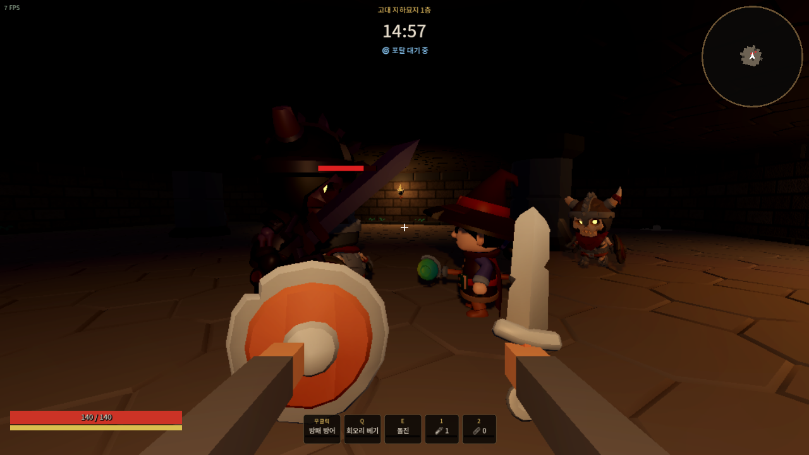
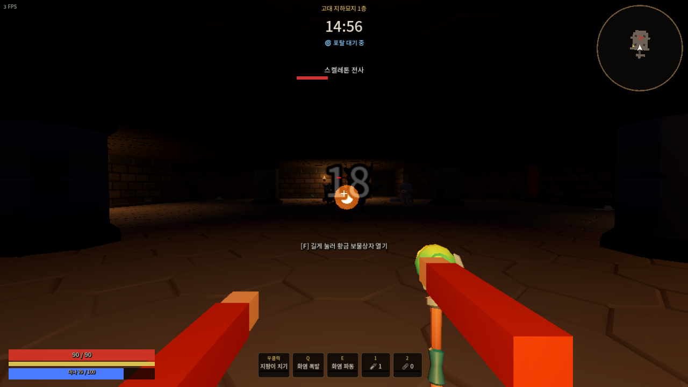

# 친구와 함께하기 (온라인 멀티플레이)

| 호스트 화면 (친구 파이로맨서가 공격 중) | 친구 화면 |
|---|---|
|  |  |

## 방법 1. 한 명이 호스트 (가장 간단)

1. 모두 같은 버전의 게임을 실행합니다 (같은 커밋을 `git pull` 하거나 같은 .exe).
2. 호스트: 로비 오른쪽 **함께하기** 탭 → 이름 입력 → **🏠 호스트 열기**
3. 친구: **함께하기** 탭 → 호스트 주소 입력 → **🔗 접속**
4. 대기실에 모두 보이면 호스트(👑)가 **⚔ 함께 입장**을 누릅니다. 각자 로비에서 고른 직업/장비/가방을 가지고 같은 던전에 들어갑니다.

### 어떤 주소를 입력하나요?

| 상황 | 호스트 주소 |
|---|---|
| 같은 PC에서 창 두 개로 시험 | `127.0.0.1` |
| 같은 집 공유기/와이파이 | 호스트 PC의 내부 IP (`ipconfig` → IPv4, 예: `192.168.0.10`) |
| 인터넷 너머 친구 (추천) | [Tailscale](https://tailscale.com/) 등 가상 LAN을 둘 다 설치하고 호스트의 `100.x.x.x` 주소 |
| 인터넷 너머 친구 (포트포워딩) | 공유기에서 **UDP 7777** 을 호스트 PC로 포트포워딩 → 호스트의 공인 IP |

- Windows 방화벽이 처음에 묻는다면 **허용**을 누르세요 (UDP 7777).
- 포트는 함께하기 탭에서 바꿀 수 있습니다 (모두 같은 포트).

### 한 PC에서 두 개 실행해 시험하기

저장 파일이 겹치지 않게 프로필을 나눕니다.

```bash
godot --path godot -- --profile a
godot --path godot -- --profile b
```

## 방법 2. 온라인(클라우드) 서버 — 계정·저장이 서버에

AWS 같은 클라우드에 서버를 하나 띄워 두면 포트포워딩 없이 누구나 주소만 입력해 접속하고, 보관함/골드/장비가 **서버 계정**에 저장됩니다.
설정 방법은 **[ONLINE_SERVER.md](ONLINE_SERVER.md)** (AWS Lightsail/EC2 + Docker).

접속: 함께하기 탭 → 서버 주소 + 이름 + **PIN** → 접속 (처음이면 계정 생성)

## 방법 3. 전용 서버를 직접 실행 (VPS/항상 켜 둔 PC)

화면 없이 서버만 띄웁니다. 가장 먼저 접속한 사람이 리더(👑)가 되어 레이드를 시작합니다. 전용 서버는 기본으로 계정 DB를 사용합니다 (`--no-accounts` 면 각자 PC 저장).

```bash
godot --headless --path godot -- --server --port 7777          # 파티 (서로 아군)
godot --headless --path godot -- --server --port 7777 --pvp    # 개인전
```

VPS라면 방화벽/보안그룹에서 **UDP 7777** 을 열어 주세요.

## 규칙

- **파티(기본)**: 함께 들어간 친구끼리 아군. 프리스트 치유/수호, 드루이드 트렌트가 친구에게도 적용됩니다.
- **개인전**: 대기실에서 호스트가 체크하면 친구도 적이 되고 서로 먼 방에서 시작합니다.
- 경쟁 모험가 AI는 인원이 늘수록 줄어듭니다.
- 탈출해야 전리품을 지키는 규칙은 그대로입니다. 쓰러진 사람의 소지품은 **시체 가방**으로 떨어져 다른 사람이 주울 수 있습니다.
- 각자 결과는 **자기 PC의 저장 파일**에 반영됩니다. 먼저 탈출한 사람은 로비로 돌아가고, 남은 사람은 계속 플레이합니다 (호스트가 먼저 나가도 레이드는 뒤에서 계속 돌아갑니다 — 호스트는 게임을 끄면 안 됩니다).
- 레이드 도중 연결이 끊기면 사망과 같이 소지품을 잃습니다. 레이드 시작 전에 끊기면 장비는 돌려받습니다.
- 함께하기에서는 심연(2층) 포탈 대신 탈출 포탈이 3번(2분, 5분 30초, 10분) 열립니다.

## 구조 (개발자용)

- **호스트 권한 방식**: 호스트(또는 전용 서버)가 전투·몬스터·AI·상자·포탈을 모두 계산합니다.
- **내 캐릭터 이동은 즉시**: 각 클라이언트는 자기 이동을 로컬에서 바로 처리하고 위치/시점/입력(초당 30회)을 보냅니다. 서버는 이동 거리를 검사해 받아들이고, 넉백·돌진 중에는 서버 위치를 우선합니다.
- **나머지는 스냅샷**: 서버가 초당 20회 몬스터/모험가/친구 위치와 상태(float 배열, MTU 이하로 분할), 투사체, 지속 구역, 내 상태(체력·자원·쿨다운·상태이상)를 보냅니다. 다른 캐릭터는 0.1초 지연 보간으로 부드럽게 그립니다.
- **이펙트/HUD 이벤트**: 폭발, 고리, 서리, 상자 열림, 전리품 가방, 포탈, 피해 숫자, 토스트, 소리는 신뢰성 있는 이벤트로 전달됩니다.
- 던전은 같은 시드로 각자 생성합니다 (`Dungeon`의 전용 RNG).

| 파일 | 역할 |
|---|---|
| `scripts/net.gd` (오토로드 `Net`) | ENet 접속, 대기실, 레이드 시작 절차, RPC |
| `scripts/input_state.gd` | 로컬 키보드/마우스 또는 네트워크 입력 추상화 |
| `scripts/net_actor.gd` | 클라이언트의 대리 액터(보간), 호스트에서 친구 모습 |
| `scripts/game.gd` | `net` 모드(offline/host/server/client)별 진행, 스냅샷/이벤트 |

### 자동 테스트

```bash
godot --headless --path godot -- --mptest host --profile h &
godot --headless --path godot -- --mptest client --profile c
```

접속 → 함께 입장 → 원격 이동 → 원격 공격(서버 판정) → 상자 열기/모두 가져가기 → 탈출 → 각자 저장 반영까지 확인합니다.
